<!-- ░░░░░░░░░░░░░░░░░░░░░░░░░░░░░░░░░░░░░░░░░░░░░░░░░░░░░░░░░░░░░░░░░░░░░░░░░░░ -->
<!--                                  HERO BANNER                                -->
<!-- ░░░░░░░░░░░░░░░░░░░░░░░░░░░░░░░░░░░░░░░░░░░░░░░░░░░░░░░░░░░░░░░░░░░░░░░░░░░ -->

<a href="https://github.com/iamabdulhannan">
  
</a>

<!-- ░░░░░░░░░░░░░░░░░░░░░░░░░░░░░░░░░░░░░░░░░░░░░░░░░░░░░░░░░░░░░░░░░░░░░░░░░░░ -->
<!--                              ANIMATED ROLE TYPER                            -->
<!-- ░░░░░░░░░░░░░░░░░░░░░░░░░░░░░░░░░░░░░░░░░░░░░░░░░░░░░░░░░░░░░░░░░░░░░░░░░░░ -->

<div align="center">

<a href="https://github.com/iamabdulhannan">
  
</a>

<br/>

<!-- Quick-access connect pills -->
<a href="https://www.linkedin.com/in/abdul-hannan-eng/"></a>
<a href="mailto:iamabdalhannan@gmail.com"></a>
<a href="https://github.com/iamabdulhannan/Hannan-portfolio"></a>
<a href="https://github.com/iamabdulhannan/Hannan-portfolio/raw/main/public/Abdul_Hannan_Resume_professional.pdf"></a>

<br/><br/>

<!-- Live status row -->


</div>

<br/>

<!-- ░░░░░░░░░░░░░░░░░░░░░░░░░░░░░░░░░░░░░░░░░░░░░░░░░░░░░░░░░░░░░░░░░░░░░░░░░░░ -->
<!--                                  ABOUT ME                                   -->
<!-- ░░░░░░░░░░░░░░░░░░░░░░░░░░░░░░░░░░░░░░░░░░░░░░░░░░░░░░░░░░░░░░░░░░░░░░░░░░░ -->

## &nbsp; About me

> *Senior Full-Stack Engineer turning complex ideas into scalable, real-world software.*

I design, build, and ship production-grade systems for **UK** and **US** startups — from AI-driven enterprise platforms and fintech dashboards, to real-time collaboration tools and Adobe creative extensions.

I take **end-to-end ownership**: from database schema, through API design, frontend architecture, and deployment pipelines, all the way to the live customer flow.

```ts
const abdul = {
  role:        "Senior Software Engineer",
  focus:       ["Full-Stack", "AI Systems", "Real-time Platforms"],
  stack:       ["React", "TypeScript", "NestJS", "Python", "MongoDB"],
  currently:   ["Lifecycle PLM (UK · Remote)", "Orbiqon (US · Remote)"],
  shipping:    "AI-driven SaaS, fintech surfaces, Adobe extensions",
  available:   true,
  timezones:   ["UK", "US", "APAC overlap"],
  motto:       "The best code is the one that ships and scales.",
};
```

<br/>

<!-- ░░░░░░░░░░░░░░░░░░░░░░░░░░░░░░░░░░░░░░░░░░░░░░░░░░░░░░░░░░░░░░░░░░░░░░░░░░░ -->
<!--                                  TECH STACK                                 -->
<!-- ░░░░░░░░░░░░░░░░░░░░░░░░░░░░░░░░░░░░░░░░░░░░░░░░░░░░░░░░░░░░░░░░░░░░░░░░░░░ -->

## &nbsp; Tech stack

<table>
<tr>
<td valign="top" width="33%">

#### Frontend


<sub>React 18 · Next.js · TypeScript · Tailwind · shadcn/ui · Chakra UI · Material UI · Three.js · React Flow · Framer Motion</sub>

</td>
<td valign="top" width="33%">

#### Backend


<sub>NestJS · Express · Apollo · GraphQL · REST · Socket.io · Redis pub/sub · Bull queue · OpenAI · Runware</sub>

</td>
<td valign="top" width="33%">

#### Cloud & Tooling


<sub>AWS (S3, CloudFront, Lambda) · GCP · Vercel · Docker · GitHub Actions · MongoDB · PostgreSQL · Firebase · Sentry</sub>

</td>
</tr>
</table>

<br/>

<!-- ░░░░░░░░░░░░░░░░░░░░░░░░░░░░░░░░░░░░░░░░░░░░░░░░░░░░░░░░░░░░░░░░░░░░░░░░░░░ -->
<!--                                  GITHUB STATS                               -->
<!-- ░░░░░░░░░░░░░░░░░░░░░░░░░░░░░░░░░░░░░░░░░░░░░░░░░░░░░░░░░░░░░░░░░░░░░░░░░░░ -->

## &nbsp; GitHub in numbers

<div align="center">

<table>
<tr>
<td>

</td>
<td>

</td>
</tr>
</table>


<br/><br/>


</div>

<br/>

<!-- ░░░░░░░░░░░░░░░░░░░░░░░░░░░░░░░░░░░░░░░░░░░░░░░░░░░░░░░░░░░░░░░░░░░░░░░░░░░ -->
<!--                                   TROPHIES                                  -->
<!-- ░░░░░░░░░░░░░░░░░░░░░░░░░░░░░░░░░░░░░░░░░░░░░░░░░░░░░░░░░░░░░░░░░░░░░░░░░░░ -->

## &nbsp; Trophies

<div align="center">
<a href="https://github.com/ryo-ma/github-profile-trophy">

</a>
</div>

<br/>

<!-- ░░░░░░░░░░░░░░░░░░░░░░░░░░░░░░░░░░░░░░░░░░░░░░░░░░░░░░░░░░░░░░░░░░░░░░░░░░░ -->
<!--                                CONTRIBUTION SNAKE                           -->
<!-- ░░░░░░░░░░░░░░░░░░░░░░░░░░░░░░░░░░░░░░░░░░░░░░░░░░░░░░░░░░░░░░░░░░░░░░░░░░░ -->

## &nbsp; Contribution snake

<div align="center">

<picture>
  <source media="(prefers-color-scheme: dark)" srcset="https://raw.githubusercontent.com/iamabdulhannan/iamabdulhannan/output/github-snake-dark.svg" />
  <source media="(prefers-color-scheme: light)" srcset="https://raw.githubusercontent.com/iamabdulhannan/iamabdulhannan/output/github-snake.svg" />
  
</picture>

</div>

<br/>

<!-- ░░░░░░░░░░░░░░░░░░░░░░░░░░░░░░░░░░░░░░░░░░░░░░░░░░░░░░░░░░░░░░░░░░░░░░░░░░░ -->
<!--                                FEATURED WORK                                -->
<!-- ░░░░░░░░░░░░░░░░░░░░░░░░░░░░░░░░░░░░░░░░░░░░░░░░░░░░░░░░░░░░░░░░░░░░░░░░░░░ -->

## &nbsp; Featured projects

<table>
<tr>
<td width="50%" valign="top">

### <kbd>&nbsp;ENTERPRISE&nbsp;</kbd>&nbsp; Lifecycle PLM

> *AI-driven product lifecycle platform for fashion brands. Trusted by teams managing millions in product lines.*

<sub>**Role:** Founding-team Senior Software Engineer · UK Remote · 2024 → present</sub>

`React 18` `TypeScript` `NestJS` `GraphQL` `MongoDB` `Redis` `Socket.io` `OpenAI`

**What I shipped:**
- AI Studio: OpenAI + Runware + Replicate behind a unified prompt UI
- 50+ backend modules · 44+ frontend modules
- Real-time collaboration via Socket.io + Redis pub/sub
- Workflow engine: declarative state machines for sampling, approvals, production
- Three.js / React Three Fiber 3D product views
- Adobe Illustrator CEP extension covering 9+ Adobe apps

[`Visit live`](https://www.lifecycleplm.com/) &nbsp;·&nbsp; [`Read case study`](https://github.com/iamabdulhannan/Hannan-portfolio)

</td>
<td width="50%" valign="top">

### <kbd>&nbsp;CREATIVE&nbsp;</kbd>&nbsp; Lifecycle Adobe Extension

> *Native Adobe Illustrator panel that brings PLM directly into the designer's canvas. No context switching.*

<sub>**Role:** Lead Engineer · Solo IC · 2024 → present</sub>

`React 18` `TypeScript` `Material UI` `Apollo Client` `CEP Framework` `ExtendScript` `AWS S3`

**What I shipped:**
- Production-grade CEP panel for Illustrator v25 → v30
- Dual runtime: React in browser context · ExtendScript in Adobe runtime
- Smart bounding-box algorithm for annotation trimming
- Multi-app architecture: 9+ Adobe apps from one codebase
- Automated ZXP signing & release via GitHub Actions
- Presigned-URL uploads to AWS S3 / CloudFront

[`Adobe Exchange`](https://exchange.adobe.com/apps/cc/search?q=lifecycle%20plm) &nbsp;·&nbsp; [`Read case study`](https://github.com/iamabdulhannan/Hannan-portfolio)

</td>
</tr>
<tr>
<td width="50%" valign="top">

### <kbd>&nbsp;AI&nbsp;</kbd>&nbsp; RevOps AI

> *AI-powered revenue operations assistant. Turns scattered sales data into pipeline insight, forecasts, and next-best-action.*

<sub>**Role:** Founding Frontend & AI Engineer · 2025</sub>

`Next.js` `TypeScript` `OpenAI` `Vercel AI SDK` `shadcn/ui`

- LLM-driven pipeline analysis with streamed answers
- Tool-use agents over CRM, billing, support
- Forecasting + next-best-action queue
- Modern shadcn/ui surface, fully accessible

[`Visit live`](https://revops-ai-five.vercel.app/) &nbsp;·&nbsp; [`Read case study`](https://github.com/iamabdulhannan/Hannan-portfolio)

</td>
<td width="50%" valign="top">

### <kbd>&nbsp;FINTECH&nbsp;</kbd>&nbsp; vSignal · Capiwise

> *Crypto-macro intelligence and real-time market dashboards for retail and pro traders.*

<sub>**Role:** Frontend Engineer · 2023–2025</sub>

`Next.js` `TypeScript` `REST APIs` `Chart.js` `SSR` `Apollo`

- Editorial home with radar-pulse hero & quant-insight motif
- Reusable signal cards for macro, sentiment, on-chain
- Real-time portfolio tracking · sub-16ms re-renders
- Tabular figures & responsive across mobile / tablet / desktop

[`vSignal`](https://vsignal.ai/) &nbsp;·&nbsp; [`Capiwise`](https://capiwise.com/)

</td>
</tr>
<tr>
<td width="50%" valign="top">

### <kbd>&nbsp;ENTERPRISE&nbsp;</kbd>&nbsp; Apex DMS

> *Multi-workspace document management with hierarchical structure, role-based access, and template-driven PDF export.*

<sub>**Role:** Senior Frontend Engineer · 2023–2024</sub>

`React 18` `TypeScript` `Django` `PostgreSQL` `Celery` `RabbitMQ` `Puppeteer`

- Multi-tenant isolation enforced at data, API, and UI layers
- Hierarchical document tree (document → chapter → section)
- Template-driven Puppeteer PDF generation
- Multi-format I/O (CSV, Excel, JSON, YAML)

[`Visit live`](https://dev.mt-emea-dmt.apexdigital.online/)

</td>
<td width="50%" valign="top">

### <kbd>&nbsp;SAAS&nbsp;</kbd>&nbsp; Outfts · Bonus9ja

> *Social commerce for global fashion brands and high-traffic engagement platforms with sub-second time-to-content.*

<sub>**Role:** Frontend Engineer · 2023–2024</sub>

`Next.js` `TypeScript` `Apollo GraphQL` `Stripe` `SSR`

- SSR-optimized for SEO and fast first paint
- Stripe Elements with full webhook reconciliation
- Selective hydration for live-odds widgets
- A/B-able landing variants owned by growth team

[`Outfts`](https://www.outfts.com) &nbsp;·&nbsp; [`Bonus9ja`](https://www.bonus9ja.com/)

</td>
</tr>
</table>

<br/>

<!-- ░░░░░░░░░░░░░░░░░░░░░░░░░░░░░░░░░░░░░░░░░░░░░░░░░░░░░░░░░░░░░░░░░░░░░░░░░░░ -->
<!--                              WORK EXPERIENCE                                -->
<!-- ░░░░░░░░░░░░░░░░░░░░░░░░░░░░░░░░░░░░░░░░░░░░░░░░░░░░░░░░░░░░░░░░░░░░░░░░░░░ -->

## &nbsp; Where I've made things

<table>
<tr>
<td><b>Senior Software Engineer</b></td>
<td>Lifecycle PLM <sub>(UK · Remote)</sub></td>
<td><sub>Jan 2024 → Present</sub></td>
<td></td>
</tr>
<tr>
<td><b>Software Engineer</b></td>
<td>Orbiqon <sub>(US · Remote)</sub></td>
<td><sub>Apr 2023 → Present</sub></td>
<td></td>
</tr>
</table>

<br/>

<!-- ░░░░░░░░░░░░░░░░░░░░░░░░░░░░░░░░░░░░░░░░░░░░░░░░░░░░░░░░░░░░░░░░░░░░░░░░░░░ -->
<!--                          WHAT I BRING TO THE TABLE                          -->
<!-- ░░░░░░░░░░░░░░░░░░░░░░░░░░░░░░░░░░░░░░░░░░░░░░░░░░░░░░░░░░░░░░░░░░░░░░░░░░░ -->

## &nbsp; What I bring to the table

| | |
|---|---|
| **Enterprise SaaS** | Platforms with 50+ modules serving real production workloads. |
| **AI integration** | Hands-on with OpenAI, Runware, Replicate, Vercel AI SDK for shipped features. |
| **Real-time systems** | Socket.io, Redis pub/sub, optimistic UI, conflict reconciliation. |
| **Adobe extension dev** | Bridging modern React with Adobe's CEP / ExtendScript ecosystem. |
| **Full ownership** | Database schema → API → frontend → CI/CD → live customers. |
| **Startup speed** | High-output environments, multiple hats, ship-first culture. |

<br/>

<!-- ░░░░░░░░░░░░░░░░░░░░░░░░░░░░░░░░░░░░░░░░░░░░░░░░░░░░░░░░░░░░░░░░░░░░░░░░░░░ -->
<!--                                 QUOTE BLOCK                                 -->
<!-- ░░░░░░░░░░░░░░░░░░░░░░░░░░░░░░░░░░░░░░░░░░░░░░░░░░░░░░░░░░░░░░░░░░░░░░░░░░░ -->

<div align="center">

</div>

<br/>

<!-- ░░░░░░░░░░░░░░░░░░░░░░░░░░░░░░░░░░░░░░░░░░░░░░░░░░░░░░░░░░░░░░░░░░░░░░░░░░░ -->
<!--                                  LET'S CONNECT                              -->
<!-- ░░░░░░░░░░░░░░░░░░░░░░░░░░░░░░░░░░░░░░░░░░░░░░░░░░░░░░░░░░░░░░░░░░░░░░░░░░░ -->

## &nbsp; Let's build something

<div align="center">

I'm always open to interesting conversations and collaborations.<br/>
If you're shipping something ambitious — let's talk.

<br/><br/>

<a href="mailto:iamabdalhannan@gmail.com"></a>
<a href="https://www.linkedin.com/in/abdul-hannan-eng/"></a>
<a href="https://github.com/iamabdulhannan/Hannan-portfolio"></a>

</div>

<!-- ░░░░░░░░░░░░░░░░░░░░░░░░░░░░░░░░░░░░░░░░░░░░░░░░░░░░░░░░░░░░░░░░░░░░░░░░░░░ -->
<!--                                  FOOTER WAVE                                -->
<!-- ░░░░░░░░░░░░░░░░░░░░░░░░░░░░░░░░░░░░░░░░░░░░░░░░░░░░░░░░░░░░░░░░░░░░░░░░░░░ -->


